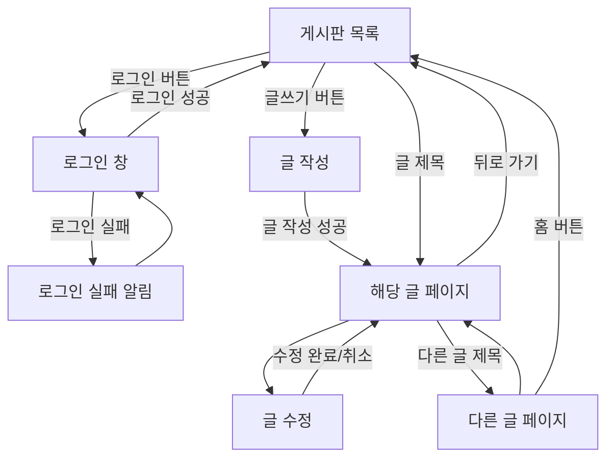
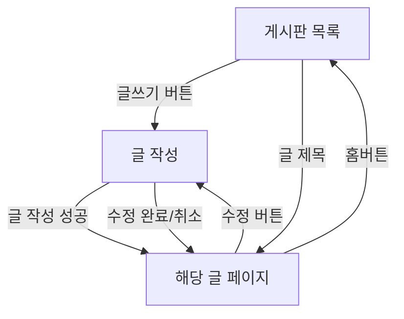

# 프로그래밍

1. 설계

- 게시판 만들자
- 회원가입
- 로그인
- 글쓰기
  - 여러 정보: 추천, 조회수, 날짜...
- 댓글창
- 검색
- 페이징

## 위를 봤을 때 흐름은?

- 게시글 목록
  - 출력 방법(V)
  - html, css, js
  - table (list)
    - table 사용법 숙지, R&D
  - grid
  - 헤더:
    - 번호
    - \*제목
    - \*글쓴이
    - 작성일
    - 조회수
  - 저장 방법(M)
    - localStorage 이용

2. 구현

   1. 게시글 목록
   2. 글 작성
   3. 게시글 페이지

3. 테스트
